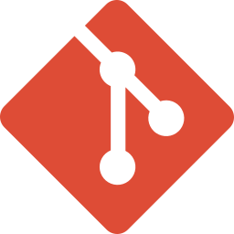

Under graduation in System Analysis and Development at Federal University of Ceará. 
Exeperience in R&D, focused on backend and developing solutions integrated at GitHub environment.
 

### Languages

### Currently learning:
<a href="https://go.dev/">
  <picture>
    <source media="(prefers-color-scheme: dark)" srcset="assets/go_dark.svg">
    
  </picture>
</a>
<a href="https://orm.drizzle.team/">
  <picture>
    <source media="(prefers-color-scheme: dark)" srcset="assets/drizzle_dark.svg">
    
  </picture>
</a>

### Frameworks I worked with:
<a href="https://expressjs.com/">
  <picture>
    <source media="(prefers-color-scheme: dark)" srcset="assets/express_dark.svg">
    
  </picture>
</a>

<a href="https://react.dev/">
  <picture>
    <source media="(prefers-color-scheme: dark)" srcset="assets/react_dark.svg">
    
  </picture>
</a>
<a href="https://www.tensorflow.org/">
  <picture>
    <source media="(prefers-color-scheme: dark)" srcset="assets/tensorflow_dark.svg">
    
  </picture>
</a>

<a href="https://fastify.dev/">
  <picture>
    <source media="(prefers-color-scheme: dark)" srcset="assets/fastify_dark.svg">
    
  </picture>
</a>

### Package manager/runtime

### Database & DBMS:

<a href="https://www.mongodb.com/">
  <picture>
    <source media="(prefers-color-scheme: dark)" srcset="assets/mongodb_dark.svg">
    
  </picture>
</a>

### Tools

### Also interested in
<a href="https://www.rust-lang.org/">
  <picture>
    <source media="(prefers-color-scheme: dark)" srcset="assets/rust_dark.svg">
    
  </picture>
</a>

